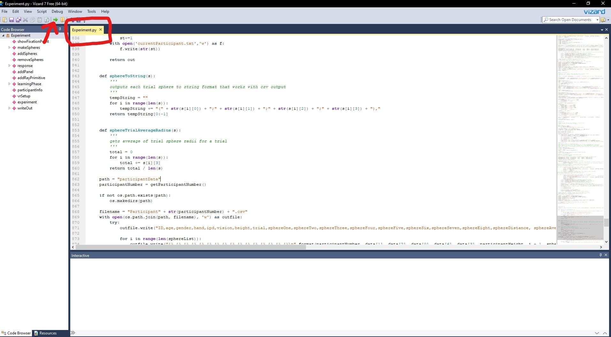

# Instructions for VR Experiment
- if you have any questions, don't be afraid to text Kaleb for help @ (603) 948 5346

## Setup Before Participant Arrives
- Make sure HDMI cable is connected to both the headset and computer through the GPU HDMI port
    - It should already be plugged in correctly, but if it is unplugged for any reason, text me and I can tell you how to plug it back in if you don't know how
- Plug in the VR headset power cable
- Press the power button on the top of the computer and wait for the screen to startup
- Once screen is on, select the lab profile and log in
    - user ID: svc_UNH_Psy_Ksk01
    - password: interdisciplinary perception lab 
        - **(spaces included, no caps)**
- Open the "Vizard 7" app, you will see the icon in the bottom bar **(seen below)**
  

- Check Sona system to make sure the participant is still signed up, and you have the right time.
- Add participant to the "Participant Logbook" excel file with their appointment time and participant number.
  - The participant number can be found in the "EnsembleExperiment" folder, and it is just the number seen in "currentParticipant.txt"
  - Keep the logbook open, and record when the participant arrives, when they put on the headset, and when they take it off.
- Within vizard, the experiment should already be opened and you should see "Experiment.py" open in the top left **(Seen below with a red box around it)**
    - If "Experiment.py" is not already open, locate the "EnsembleExperiment" folder on the desktop and drag the "Experiment.py" file into Vizard. You should then see it in the top left and it should be highlighted yellow to show it is open

- Press the green arrow that is above and to the left of the "Experiment.py" label **(seen above with a red arrow pointing towards it)**
    - A new screen should pop up with a text entry field labeled "Please put in your information"
        - During setup, skip putting in information and just click "Submit" right away, then press the space bar
- Another screen called "Mixed Reality Portal" should open, and the headset should now connect. You can verify this by looking through the headset and making sure it is turned on. 
- Close out of the "Experiment" window.
- If you do these steps too early, the headset will go into sleep mode and you will need to repeat all steps below the picture above.
- Check the headset lenses, and clean them using the microfiber cloth if nessesary

## After Participant Arrives
- Be on the lookout for the participant arriving, the hallway is confusing to people
- When the participant arrives, greet them, confirm their name matches the name on the appointment, and bring them into the lab room.
  - On your way in, make sure to switch the sign to say "Experiment in progress" on the door
  - Ask the participant to put all their devices on silent **(and you should do the same)** and place their phone/ smart watch/ anything that could cause a distraction on the shelf or table nearby
- Ask the participant to sit down at a desk and hand them the consent form to fill out. Tell them if they have any questions about it or are confused that they can ask you for help or clarification.
- Once they complete the consent form and you check to make sure everything is filled out correctly, sit the participant out front of the desk with the monitor.
- **Put the consent form with all the others in a safe place**
  
### Taking IPD
- Tell the participant you will now measure their inter pupulary distance, and you can explain what this is and why you need it if they want to know. 
- Warn the participant that you will get close and touch the bridge of their nose with a ruler
- Once the participant consents to getting their IPD taken, use the ruler branded "zyaid" on the side to take their IDP
  - Ask the participant to stare directly over your shoulder, line the 0mm mark up with the middle of their left pupil, and measure the distance to the middle of their right pupil. Make sure to write this number down or remember it for later.
  - If needed, measure twice and then take the average for the IPD

### Starting the Experiment
- Once everything is ready, ask the participant to remove any head covering or hair style that may get in the way of the VR headset **(If they have a religious headcovering please don't ask them to remove it, try to work around it)**
- Ask the participant which hand they would prefer to hold the controller in, and turn that one on. **(if both controllers are on, hold the windows button to turn the one not in use off)**
- Start up the experiment again using the green arrow, and press the submit button then the space bar, close out of the window one last time, and then reopen it.
- Have the participant fill out the form this time, making sure to put in the correct IPD from earlier.
  - When they are ready, they can press the submit button, and you can switch them to the VR headset

- Put the headset on the participant making sure to adjust the back knob to make it tight as well as the velcro top to pull it higher up **(if the headset is not properly adjusted, the participant will have blurry vision. Ask to make sure the headset is comfortable and that they can see clearly)**
- Either ask to adjust the IPD using the slider below their right eye, or have the participant do it themselves. Get it as close as possible to the number you measured earlier
- Hand the participant the controller, **make sure to slide the wrist wrap over their wrist, these controllers are expensive**

- The participant will load into the waiting room in VR, and you can see this in the "Mixed reality" window
  - Teach the participant what buttons they need to press **(the trigger and joystick)**
  - Teach the participant the windows and menu buttons and how to get rid of those if they pop up, but also that they should avoid pressing the buttons if possible.
- When the participant is ready to continue, you can let them know they will load into the experiment, and you can press the space button to continue

- Look at the Vizard screen at the bottom, if you see the message below **(it will be highlighted in red in vizard)**, you need to restart the program by closing out and pressing the green arrow again. The controller will not work if this message is seen:

 
Traceback (most recent call last):   
&nbsp; File "C:\Program Files\WorldViz\Vizard7\python\viztask.py", line 773, in updateAndKillOnException   
  &nbsp;&nbsp;&nbsp;&nbsp;  return self.update()   
&nbsp;  File "C:\Program Files\WorldViz\Vizard7\python\viztask.py", line 738, in update   
  &nbsp;&nbsp;&nbsp;&nbsp;  val = self._stack[-1].send(sendData)   
&nbsp; File "C:\Users\svc_UNH_Psy_Ksk01\Desktop\EnsembleExperiment\Experiment.py", line 525, in learningPhase   
  &nbsp;&nbsp;&nbsp;&nbsp;  yield viztask.waitSensorDown(controller, [steamvr.BUTTON_TRIGGER])   
NameError: name 'controller' is not defined   

 

- If this message does not show up, the experiment is ready to be run
  - If it does, make sure the correct controller is on, and then either ask the participant for their answers to the information panel, or have them take off the headset to redo it one last time.

### Guiding Participant Through the Experiment
- When the participant begins, keep track of their progress using both the "Mixed reality Portal" and "Experiment" windows. Have one open on the left, and the other open on the right, as well as the "Vizard" window somewhere so you can read the bottom for any messages that appear.
  - You will see when they reach the tutorials through these windows, so ask them if they understand, and talk them through the learning phases. These are confusing the first time someone runs through them. Explain the goal, how to answer, and which buttons to use.
    - They have a learning phase for the depth test as well as the overall experiment, so make sure they seem to know what they are doing during these phases.
    - **Do not guide them or give tips or any information through the actual test and experiment, we want as little instructor input after the learning phases so as not to skew the results. For example, do not tell them how many trials there are, or answer questions about how good they are doing. You can tell them "I can answer that at the end of the experiment"**
- You can let the participant know that they will have breaks around every 4-5 minutes, and that overall the experiment will take around 30 minutes total.
- During breaks, participants are allowed to take off their headset, but make sure it is no longer than 3-4 minutes so the controller and headset do not go to sleep.
  - Make sure at least one of the breaks are around 30 seconds so that the participant has time to rest.
- When the participant finishes, they will be told to take off their headset. Help the participant if they need it. If they reach this point, all the data should already be saved in the "participantData" folder. It is safe to close all windows.
  - If another participant is scheduled, you can keep the "Vizard" and "Mixed Reality Portal" windows open, but need to close the "Experiment" window to reset the experiment and controller.
- Ask the participant if they have any questions about the experiment. Answer to the best of your knowledge. If they want to know more, you can give them my email: kaleb.ducharme@unh.edu.
- Tell the participant that you will put their Sona credit into the system, and they should see it within a couple of minutes. **Make sure they grab all of their belongings before leaving, and to thank them for their time**
- Put the rest of the information into the Excel Spreadsheet "Participant LogBook". **Make sure you check off that you provided Sona credit only after you already do so, so that we know the participant got their credit**
- If you are the last person in lab, turn off the computer by pressing the windows logo at the bottom of the monitor, then the power button, and press "Shut down"
- Unplug the headset power cable from the connector
- When leaving, make sure the keys are in the lock box **(dont want to lock them in the room)**, the lights are off, and that the door is locked
